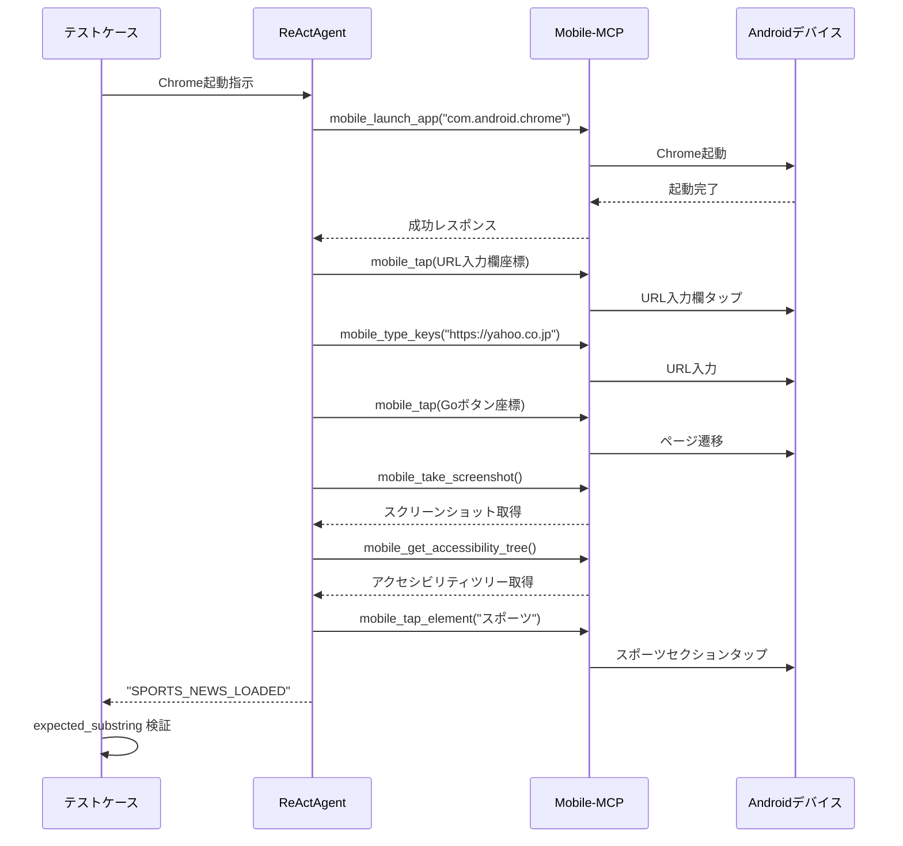

# Android版BaseAgentTest 実装計画書

## 1. Mobile-MCPを使用したAndroid BaseAgentTest 置き換え計画

### 1.1 現状分析

#### 既存 BaseAgentTest の特徴
- **Browser Use** を使用したWebブラウザ自動化
- **Allure** との統合によるテストレポート生成
- **expected_substring** による成功/失敗判定メカニズム
- **pytest** フレームワークとの連携

#### 置き換え対象コンポーネント
```python
# 現在のBaseAgentTest構造
BaseAgentTest
├── validate_task() メソッド
│   ├── Browser Use エージェント実行
│   ├── expected_substring 検証
│   └── Allure ステップ記録
├── BASE_URL 設定
└── 共通テストインフラ
```

### 1.2 Mobile-MCP 置き換え設計

#### 新しいAndroidBaseAgentTest構造
```python
AndroidBaseAgentTest
├── validate_mobile_task() メソッド
│   ├── Mobile-MCP エージェント実行
│   ├── expected_substring 検証  
│   └── Allure ステップ記録
├── DEFAULT_APP_BUNDLE_ID 設定
└── 共通モバイルテストインフラ
```

## 2. Allure統合の詳細マッチング計画

### 2.1 既存Allure統合の分析

#### conftest.py の主要機能
```python
# 既存のAllure統合ポイント
1. record_step() 関数 - エージェントステップの記録
2. environment_reporter() - 環境情報の記録
3. スクリーンショット添付機能
4. エージェント思考プロセスの記録
5. 実行時間測定
```

#### 既存のAllure添付情報
- スクリーンショット (PNG)
- エージェント思考プロセス (TXT)
- ステップ実行時間
- 環境情報 (プラットフォーム、ブラウザバージョンなど)

### 2.2 Mobile-MCP用Allure統合設計

#### 新しいAllure統合ポイント
```python
# Android版Allure統合
1. record_mobile_step() 関数 - モバイルエージェントステップの記録
2. mobile_environment_reporter() - モバイル環境情報の記録  
3. アクセシビリティツリー添付機能
4. モバイルスクリーンショット添付機能
5. アプリ状態情報の記録
6. デバイス情報の記録
```

#### Android版Allure添付情報
- モバイルスクリーンショット (PNG)
- アクセシビリティツリー (XML/JSON)
- エージェント思考プロセス (TXT)
- アプリ情報 (Bundle ID、バージョン)
- デバイス情報 (OS版、解像度、機種名)
- 実行時間測定

## 3. LangChain/LangGraph with ReActAgent 実装仕様

### 3.1 技術スタック

#### 必要なライブラリ
```python
# 基本ライブラリ
langchain>=0.3.0
langgraph>=0.2.0 
langchain-openai>=0.2.0
langchain-mcp-adapters>=0.1.0

# テスト関連
pytest>=8.0.0
pytest-asyncio>=0.23.0
allure-pytest>=2.14.0

# Mobile-MCP関連  
appium-python-client>=4.0.0
selenium>=4.0.0
fastmcp>=1.0.0
```

#### ReActAgent 設定
```python
from langgraph.prebuilt import create_react_agent
from langchain_mcp_adapters.client import MultiServerMCPClient
from langchain_openai import ChatOpenAI

# Mobile-MCP クライアント設定
mobile_client = MultiServerMCPClient({
    "mobile": {
        "command": "python",
        "args": ["-m", "mobile_mcp.server"],
        "transport": "stdio",
        "env": {
            "APPIUM_SERVER": "http://localhost:4723",
            "LOG_LEVEL": "INFO"
        }
    }
})

# ReActAgent 構築
llm = ChatOpenAI(model="gpt-4-turbo", temperature=0)
mobile_tools = await mobile_client.get_tools()
mobile_agent = create_react_agent(llm, mobile_tools)
```

### 3.2 MCP Adapter 使用方法

#### MultiServerMCPClient 設定
```python
class AndroidBaseAgentTest:
    def __init__(self):
        self.mcp_client = MultiServerMCPClient({
            "mobile": {
                "transport": "stdio", 
                "command": "python",
                "args": ["-m", "mobile_mcp.server"],
                "env": {
                    "APPIUM_SERVER": os.getenv("APPIUM_SERVER", "http://localhost:4723"),
                    "DEVICE_PLATFORM": "android"
                }
            }
        })
        
    async def setup_agent(self):
        """モバイルエージェントのセットアップ"""
        self.mobile_tools = await self.mcp_client.get_tools()
        self.agent = create_react_agent(
            self.llm,
            self.mobile_tools,
            prompt="You are a mobile app testing assistant. When you successfully complete a task, always end your response with the exact phrase specified in the instructions."
        )
```

#### ツール実行パターン
```python
async def execute_mobile_task(self, task_instruction: str):
    """Mobile-MCPツールを使用したタスク実行"""
    response = await self.agent.ainvoke({
        "messages": [
            HumanMessage(content=task_instruction)
        ]
    })
    return response["messages"][-1].content
```

## 4. Android BaseAgentTest 実装詳細

### 4.1 クラス設計

#### AndroidBaseAgentTest クラス
```python
import asyncio
import allure
from typing import Optional
from langchain_openai import ChatOpenAI
from langchain_mcp_adapters.client import MultiServerMCPClient
from langgraph.prebuilt import create_react_agent

class AndroidBaseAgentTest:
    """Android アプリケーション自動化テスト用の基底クラス"""
    
    DEFAULT_APP_BUNDLE_ID = "com.android.chrome"
    APPIUM_SERVER_URL = "http://localhost:4723"
    
    def __init__(self):
        self.mcp_client = None
        self.agent = None
        self.llm = ChatOpenAI(
            model="gpt-4-turbo",
            temperature=0,
            timeout=60
        )
    
    async def setup_mobile_agent(self):
        """モバイルエージェントの初期化"""
        self.mcp_client = MultiServerMCPClient({
            "mobile": {
                "transport": "stdio",
                "command": "python", 
                "args": ["-m", "mobile_mcp.server"],
                "env": {
                    "APPIUM_SERVER": self.APPIUM_SERVER_URL,
                    "DEVICE_PLATFORM": "android"
                }
            }
        })
        
        mobile_tools = await self.mcp_client.get_tools()
        self.agent = create_react_agent(
            self.llm,
            mobile_tools,
            prompt=self._get_mobile_prompt()
        )
    
    def _get_mobile_prompt(self) -> str:
        """モバイルエージェント用プロンプト"""
        return """You are a mobile app testing assistant for Android devices.
        
Your capabilities include:
- Taking screenshots of the current screen
- Getting accessibility tree information
- Tapping elements by coordinates or accessibility identifiers  
- Typing text input
- Swiping and scrolling
- Launching and managing applications
- Navigating between apps

When you successfully complete a task, always end your response with the exact phrase specified in the instructions. This is crucial for test validation.

Always be precise with coordinates and element identification. Use accessibility tree information to locate elements accurately before performing actions.
"""

    @allure.step("Execute mobile task: {task_instruction}")
    async def validate_mobile_task(
        self,
        task_instruction: str,
        expected_substring: Optional[str] = None,
        ignore_case: bool = False,
        device_id: Optional[str] = None,
        app_bundle_id: Optional[str] = None
    ) -> str:
        """
        モバイルタスクの実行と検証
        
        Args:
            task_instruction: エージェントに実行させる指示
            expected_substring: 結果に含まれることを期待する文字列
            ignore_case: 大文字小文字を無視するか
            device_id: 対象デバイスID (未指定時は接続済みデバイス使用)
            app_bundle_id: 対象アプリのBundle ID
            
        Returns:
            エージェントの実行結果
        """
        
        # デバイス接続確認
        if device_id:
            connect_task = f"Connect to Android device {device_id}"
            await self._execute_agent_task(connect_task)
        
        # アプリ起動（指定された場合）
        if app_bundle_id:
            launch_task = f"Launch application {app_bundle_id}"
            await self._execute_agent_task(launch_task)
        
        # メインタスク実行
        result_text = await self._execute_agent_task(task_instruction)
        
        # 結果検証
        assert result_text is not None, "Agent returned None result"
        
        if expected_substring:
            result_to_check = result_text.lower() if ignore_case else result_text
            substring_to_check = (
                expected_substring.lower() if ignore_case else expected_substring
            )
            assert (
                substring_to_check in result_to_check
            ), f"Assertion failed: Expected '{expected_substring}' not found in agent result: '{result_text}'"
        
        return result_text
    
    async def _execute_agent_task(self, task: str) -> str:
        """エージェントタスクの実行"""
        with allure.step(f"Agent task: {task}"):
            start_time = time.time()
            
            try:
                # エージェント実行
                response = await self.agent.ainvoke({
                    "messages": [HumanMessage(content=task)]
                })
                
                result = response["messages"][-1].content
                duration = time.time() - start_time
                
                # Allure 添付情報
                await self._attach_mobile_context(task, result, duration)
                
                return result
                
            except Exception as e:
                allure.attach(
                    str(e),
                    name="Error Details",
                    attachment_type=allure.attachment_type.TEXT
                )
                raise
    
    async def _attach_mobile_context(self, task: str, result: str, duration: float):
        """モバイルコンテキストのAllure添付"""
        
        # スクリーンショット取得・添付
        try:
            screenshot_response = await self.agent.ainvoke({
                "messages": [HumanMessage(content="Take a screenshot")]
            })
            screenshot_b64 = screenshot_response["messages"][-1].content
            
            import base64
            screenshot_bytes = base64.b64decode(screenshot_b64)
            allure.attach(
                screenshot_bytes,
                name=f"Screenshot - {task}",
                attachment_type=allure.attachment_type.PNG
            )
        except Exception:
            pass
        
        # アクセシビリティツリー取得・添付
        try:
            tree_response = await self.agent.ainvoke({
                "messages": [HumanMessage(content="Get accessibility tree")]
            })
            tree_xml = tree_response["messages"][-1].content
            
            allure.attach(
                tree_xml,
                name=f"Accessibility Tree - {task}",
                attachment_type=allure.attachment_type.XML
            )
        except Exception:
            pass
        
        # エージェント結果添付
        allure.attach(
            result,
            name=f"Agent Result - {task}",
            attachment_type=allure.attachment_type.TEXT
        )
        
        # 実行時間記録
        allure.attach(
            f"Task Duration: {duration:.2f} seconds",
            name="Execution Time",
            attachment_type=allure.attachment_type.TEXT
        )
```

### 4.2 設定ファイル

#### pytest.ini 更新
```ini
[tool:pytest]
asyncio_mode = auto
markers =
    android: Android app tests
    slow: slow tests
    integration: integration tests
testpaths = tests
python_files = test_*.py
python_functions = test_*
python_classes = Test*
addopts = 
    --allure-dir=allure-results
    --tb=short
    --strict-markers
    -v
```

#### conftest.py 更新
```python
import pytest
import asyncio
import allure
import os
from typing import Generator

@pytest.fixture(scope="session") 
def event_loop():
    """セッションスコープのイベントループ"""
    loop = asyncio.new_event_loop()
    yield loop
    loop.close()

@pytest.fixture(scope="session")
async def appium_server():
    """Appium サーバーの起動・停止"""
    # Appium サーバー起動ロジック
    # 実装省略
    yield "http://localhost:4723"
    # 停止処理

@pytest.fixture
async def android_agent():
    """Android エージェントの初期化"""
    from android_base_agent_test import AndroidBaseAgentTest
    
    agent_test = AndroidBaseAgentTest()
    await agent_test.setup_mobile_agent()
    yield agent_test
    
    # クリーンアップ
    if agent_test.mcp_client:
        # MCP クライアント切断処理
        pass

@pytest.fixture(autouse=True)
def mobile_environment_reporter():
    """モバイル環境情報のAllure報告"""
    
    # デバイス情報取得
    device_info = {
        "Platform": "Android",
        "Appium Server": os.getenv("APPIUM_SERVER", "http://localhost:4723"),
        "Test Framework": "pytest + Mobile-MCP + LangChain"
    }
    
    for key, value in device_info.items():
        allure.dynamic.parameter(key, value)
```

## 5. 計画の実装ステップ

### Phase 1: 基盤整備 (Week 1-2)
1. **Mobile-MCP サーバー実装**
   - Android Robot クラス実装  
   - MCP ツール定義・実装
   - Appium 統合

2. **langchain-mcp-adapters 統合検証**
   - MultiServerMCPClient 動作確認
   - ReActAgent との連携テスト

### Phase 2: BaseAgentTest 移植 (Week 3-4)  
1. **AndroidBaseAgentTest クラス実装**
   - validate_mobile_task メソッド実装
   - expected_substring 検証機能移植
   - エラーハンドリング整備

2. **Allure統合実装**
   - モバイル用添付機能実装
   - 環境レポート機能拡張

### Phase 3: テストケース実装 (Week 5)
1. **Chrome + Yahoo.co.jp テストケース作成**
   - Chrome 起動・サイトアクセステスト
   - スポーツニュース閲覧テスト  
   - expected_substring による検証

### Phase 4: 統合テスト・最適化 (Week 6)
1. **エンドツーエンドテスト**
2. **パフォーマンス最適化**  
3. **ドキュメント整備**

## 6. Chrome + Yahoo.co.jp テストケース設計

### 6.1 テストシナリオ

```python
@pytest.mark.android
@pytest.mark.asyncio
class TestChromeYahooSports:
    """Chrome ブラウザでYahoo.co.jpスポーツニュース閲覧テスト"""
    
    @allure.feature("Chrome Browser")
    @allure.story("Yahoo Sports News")
    async def test_chrome_yahoo_sports_access(self, android_agent):
        """Chrome でYahoo.co.jpのスポーツニュースにアクセス"""
        
        result = await android_agent.validate_mobile_task(
            task_instruction="""
            1. Launch Chrome browser app on Android device
            2. Navigate to https://yahoo.co.jp
            3. Find and tap on the Sports (スポーツ) section
            4. Verify that sports news articles are displayed
            5. If successful, respond with: "SPORTS_NEWS_LOADED"
            """,
            expected_substring="SPORTS_NEWS_LOADED",
            app_bundle_id="com.android.chrome"
        )
        
        assert "SPORTS_NEWS_LOADED" in result
    
    @allure.feature("Chrome Browser") 
    @allure.story("Yahoo Sports Article")
    async def test_chrome_yahoo_sports_article_read(self, android_agent):
        """スポーツニュース記事の詳細閲覧"""
        
        result = await android_agent.validate_mobile_task(
            task_instruction="""
            1. Ensure Chrome is open with Yahoo Sports page
            2. Tap on the first sports news article
            3. Wait for the article content to load
            4. Scroll down to read some content
            5. Verify article text is displayed
            6. If successful, respond with: "ARTICLE_CONTENT_READ"
            """,
            expected_substring="ARTICLE_CONTENT_READ"
        )
        
        assert "ARTICLE_CONTENT_READ" in result
```

### 6.2 期待される動作フロー



## 7. リスク分析と対策

### 7.1 技術リスク

| リスク | 影響度 | 確率 | 対策 |
|--------|--------|------|------|
| Mobile-MCP 安定性 | 高 | 中 | フォールバック機能実装 |
| Appium 接続問題 | 高 | 中 | リトライ機能・ヘルスチェック |
| LangChain API 変更 | 中 | 低 | バージョン固定・互換性テスト |
| デバイス固有問題 | 中 | 高 | 複数デバイスでのテスト |

### 7.2 実装リスク

| リスク | 影響度 | 確率 | 対策 |
|--------|--------|------|------|
| expected_substring 移植 | 低 | 低 | 既存実装の詳細分析済み |
| Allure統合複雑度 | 中 | 中 | 段階的実装・既存パターン踏襲 |
| パフォーマンス劣化 | 中 | 中 | プロファイリング・最適化 |

## 8. 成功基準

### 8.1 機能要件
- [ ] Chrome アプリの自動起動
- [ ] Yahoo.co.jp へのナビゲーション
- [ ] スポーツセクションの特定・タップ
- [ ] ニュース記事一覧の表示確認
- [ ] expected_substring による成功判定

### 8.2 非機能要件  
- [ ] テスト実行時間 < 3分
- [ ] 成功率 > 95%
- [ ] Allure レポート生成
- [ ] スクリーンショット・ログ完全取得

### 8.3 互換性要件
- [ ] 既存 BaseAgentTest API 互換性維持
- [ ] pytest 実行環境での動作
- [ ] CI/CD パイプライン統合対応

これで Mobile-MCP を使用した Android 版 BaseAgentTest の包括的な実装計画が完成しました。この計画に従って実装を進めることで、Browser Use から Mobile-MCP への完全な移行が実現できます。
