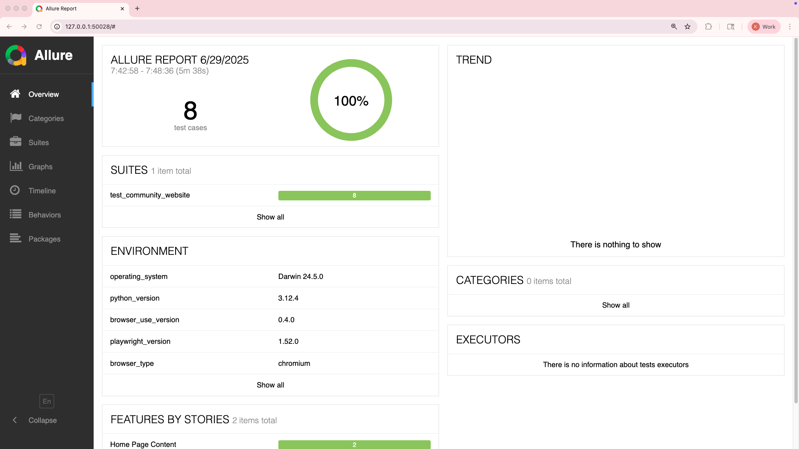
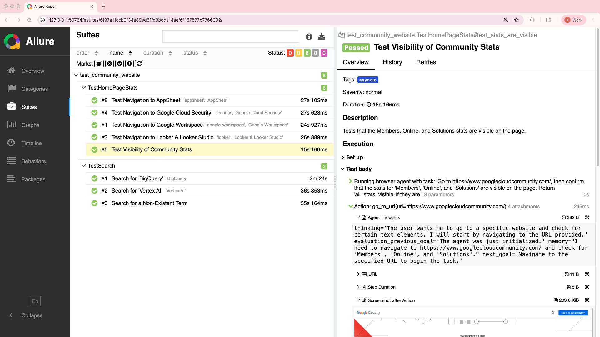

# 🤖 AgentiTest: Agentic Test Automation

This framework uses an LLM to automate browser testing through high-level, natural language commands. It's designed to be a flexible and developer-friendly tool for creating robust and maintainable browser tests.

## 🛠️ Tech Stack

* **[`browser-use`](https://github.com/browser-use/browser-use)**: Translates natural language into browser actions with an agent.
* **[`pytest`](https://github.com/pytest-dev/pytest)**: A framework for structuring and running tests.
* **[Allure Report](https://github.com/allure-framework/allure2)**: For creating interactive and detailed test reports.



## ✨ Key Features

* **Natural Language Tests**: Write tests using descriptive, natural language tasks instead of brittle selectors.
* **Adaptable Logic**: The core testing logic is designed to be easily adapted for any website.
* **Insightful Reports**: Allure reports provide screenshots, agent actions, and AI "thoughts" for each step, giving you a clear view into the test execution.
* **Environment Documentation**: Key details about the test environment—such as the OS, Python version, and browser version—are automatically included in the Allure report for better debugging and context.
* **Customizable Browser Settings**: The framework allows for detailed configuration of browser settings. For more information, see the [Browser Settings documentation](https://docs.browser-use.com/customize/browser-settings).
* **Example Implementation**: `test_community_website.py` provides a practical example of how to write a test suite.

## ⚙️ How It Works

The framework's structure is designed for clarity and scalability, separating shared logic from individual tests. It's composed of two main parts:

* **A common file (`conftest.py`)**: This central file contains `pytest` fixtures for setting up the browser and the LLM, along with a reusable `run_agent_task` helper function that executes test steps.
* **Individual test files (`test_*.py`)**: These files contain your actual tests. You import and use the `run_agent_task` function to define test scenarios in natural language, focusing on what to test, not how.



## ✍️ Writing Your Own Tests

Creating a new test is straightforward. All tests should inherit from the `BaseAgentTest` class, which provides the necessary setup for running agent-based tests.

Here’s a minimal example of a test file:

```python
import allure
import pytest
from conftest import BaseAgentTest

@allure.feature("Login Functionality")
class TestLogin(BaseAgentTest):
    """Tests for the website's login functionality."""

    @allure.story("Successful Login")
    @allure.title("Test Successful Login")
    @pytest.mark.asyncio
    async def test_successful_login(self, llm, browser_session):
        """Tests that a user can successfully log in."""
        task = "click the login button, fill in the username and password, and confirm that the user is logged in."
        await self.validate_task(llm, browser_session, task, "Welcome, user!")
```

In this example:

* `TestLogin` inherits from `BaseAgentTest`.
* The `@pytest.mark.asyncio` decorator tells pytest that this is an asynchronous test, which is necessary because the browser automation library (`browser-use`) is asynchronous.
* The test method `test_successful_login` is an `async` function that accepts `llm` and `browser_session` fixtures.
* `self.validate_task` is called with the task description and the expected result.

This structure allows you to write tests that are easy to read and maintain, focusing on the user's actions and the expected outcomes.

For more information on how to use Allure with pytest, see the [official Allure documentation](https://allurereport.org/docs/pytest).

## 🚀 Setup and Installation

1. **Create a Virtual Environment**:

    ```bash
    python -m venv venv
    source venv/bin/activate  # On Windows, use `venv\Scripts\activate`
    ```

2. **Install Dependencies**:

    ```bash
    pip install -r requirements.txt
    ```

3. **Set Up Environment Variables**:

    To get started, create a `.env` file in the root of the project by copying the provided template:

    ```bash
    cp .env.example .env
    ```

    Next, open the `.env` file and add your `GOOGLE_API_KEY`. This file is pre-configured with sensible defaults, but you can customize them to fit your needs.

    **Required Variables**:
    * `GOOGLE_API_KEY`: Your Google API key for accessing the Gemini model.

    **Optional Variables**:
    * `GEMINI_MODEL`: The specific Gemini model you want to use (e.g., `gemini-2.5-pro`). For a list of available models, see the [Gemini models documentation](https://ai.google.dev/gemini-api/docs/models).
    * `HEADLESS`: Set to `true` to run in headless mode (without a visible browser UI) or `false` to run with a visible UI.

## 🧪 Running the Tests

Once your environment is configured, you can run the tests and generate the Allure report data with a single command:

```bash
pytest
```

This will create an `allure-results` directory containing the data for your test report. The output directory is specified by the `--alluredir` parameter in `pytest.ini`, which is required for Allure to function correctly. For more details, see the [Allure pytest documentation on `alluredir`](https://allurereport.org/docs/pytest-configuration/#alluredir-%E2%9F%A8directory%E2%9F%A9).

### Customizing Test Execution with `pytest.ini`

The `pytest.ini` file allows you to customize test execution. For example, you can add default command-line options or define custom markers. For more details, see the [official pytest documentation](https://docs.pytest.org/en/stable/reference/customize.html).

## 📊 Viewing the Allure Report

To view the interactive Allure report, first make sure you have Allure installed (`npm install -g allure-commandline`), and then run:

```bash
allure serve allure-results
```

This will start a local web server and open the report in your browser to view the test results.
